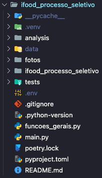

# iFood A/B Test Data Analysis - Processo Seletivo

Este projeto tem por finalidade analisar os resultados de um teste A/B em campanha de cupons disponibilizados a clientes do iFood.

Neste repositório contém os arquivos e frameworks responsáveis pelo download, processamento e análise de dados do iFood a partir de arquivos disponibilizados em Buckets S3 públicos na AWS.

O relatório completo com as análises está nesta pasta: [analysis/relatório](https://github.com/renanmarxx/ifood-ab-test-analysis/blob/main/analysis/relatorio/iFood%20-%20Relat%C3%B3rio%20-%20Case%20-%20Data%20Analysis%20-%20Teste%20A_B%20-%20Renan%20Marx%20Luz%20Mendes.pdf) e também neste [link do Google Drive](https://drive.google.com/drive/folders/1xPLzJqB2LFUyu9JJwCH64nTEklO9V-4T?usp=sharing).

O notebook com a extração dos dados e análises está nesta pasta: [analysis/ifood_test_ab_case_renan_marx.ipynb](https://github.com/renanmarxx/ifood-ab-test-analysis/blob/main/analysis/ifood_test_ab_case_renan_marx.ipynb).

## O projeto foi desenvolvido em ambiente virtual utilizando as bibliotecas `pyenv` e `poetry`. Será necessário previamente instalar essas bibliotecas para ter sucesso na execução.

## Para executar o projeto:

### 1. Acesse sua pasta de desejo para fazer o clone do repositório:
```sh
cd caminho_da_pasta
```

### 2. Dê início no git na pasta desejada:
```sh
git init
```

### 3. Faça o clone do repositório
```sh
git clone https://github.com/renanmarxx/ifood-ab-test-analysis.git
```

### 4. Acesse a pasta do resositório
```sh
cd ifood-ab-test-analysis
```

### 5. Instalar a versão do pyenv necessária:
```sh
pyenv install 3.12.5
```

### 6. Definir a versão do python que o pyenv irá trabalhar no projeto:
```sh
pyenv local 3.12.5
```

### 7. Definir a versão do python que o poetry irá trabalhar no projeto:
```sh
poetry env use 3.12.5
```

### 8. Ativar e acessar o ambiente virtual:
```sh
source .venv/Scripts/activate
```

### 9. Instalar as bibliotecas necessárias:
```sh
poetry install
```

### 10. Crie um arquivo `.env` na raiz do projeto com o seguinte conteúdo:
```
URL_S3_ORDERS="https://data-architect-test-source.s3-sa-east-1.amazonaws.com/order.json.gz"
URL_S3_CONSUMERS="https://data-architect-test-source.s3-sa-east-1.amazonaws.com/consumer.csv.gz"
URL_S3_MERCHANTS="https://data-architect-test-source.s3-sa-east-1.amazonaws.com/restaurant.csv.gz"
URL_S3_AB_TEST="https://data-architect-test-source.s3-sa-east-1.amazonaws.com/ab_test_ref.tar.gz"
```

A estrutura da pasta no diretório deve seguir o exemplo:



### 11. Execute o arquivo `main.py` para extrair os dados OU:

```sh
python main.py
```

### 12. OU Execute o notebook [ifood_test_ab_case_renan_marx.ipynb](https://github.com/renanmarxx/ifood-ab-test-analysis/blob/main/analysis/ifood_test_ab_case_renan_marx.ipynb) a partir da primeira célula para extrair os dados e executar as análises.

#### Obs.: em ambos os casos (passo 11 ou 12), a execução fará a extração dos dados necessários para as análises que foram feitas a partir de funções que foram construídas no arquivo `funcoes_gerais.py`

Arquivos principais:
- `main.py`: Script principal de execução.
- `funcoes_gerais.py`: Funções utilitárias para download, processamento e análise.
- `ifood_test_ab_case_renan_marx.ipynb`: Notebook com as análises.
- `pyproject.toml`: Dependências do projeto.
- `poetry.lock`: Configurações e demais dependências do projeto.

## Observações

- O arquivo `.env` **não é versionado** por segurança.
- Os arquivos de dados baixados e processados são salvos na pasta `./analysis/data/`.
- Para ter sucesso na definição dos ambientes virtuais, instalação de pacotes e execução dos arquivos e notebook, se faz necessário que o ambiente virtual esteja ativado e em uso.
- **Os arquivos ocupam bastante memória de execução, por conta disso recomenda-se que o projeto seja executado em ambiente com maiores recursos de máquina e memória**.

---
